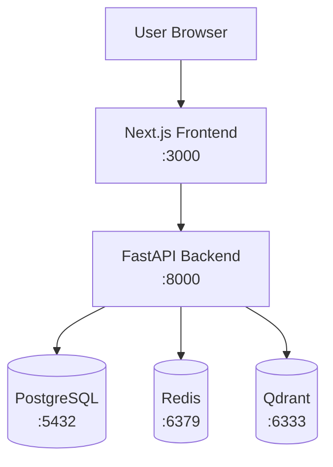

# Architecture

HunterOS is a price arbitrage monitoring platform. This document describes the foundation architecture — infrastructure and scaffolding only, with no business logic yet implemented.

## System Overview



## Components

### Frontend (Next.js + Tailwind + Shadcn/UI)

- **Framework:** Next.js 15 with App Router and TypeScript
- **Styling:** Tailwind CSS with Shadcn/UI components
- **Purpose:** Web UI for monitoring and interaction
- **Current state:** Landing page with live API/infrastructure status
- **Location:** `frontend/`

### Backend (FastAPI)

- **Framework:** FastAPI with async SQLAlchemy
- **Purpose:** REST API layer for all platform operations
- **Current state:** Health endpoints, service connections, OpenAPI docs
- **Location:** `backend/`

Key modules:

| Module | Responsibility |
|--------|----------------|
| `app/core/config.py` | Environment-based settings |
| `app/core/lifespan.py` | Connection pool lifecycle |
| `app/core/logging.py` | Structured logging |
| `app/core/exceptions.py` | Consistent error responses |
| `app/db/` | SQLAlchemy base and session factory |
| `app/services/cache.py` | Redis wrapper |
| `app/services/vector.py` | Qdrant wrapper |
| `app/api/deps.py` | FastAPI dependency injection |
| `app/api/v1/health.py` | Liveness and readiness probes |

### Database (PostgreSQL)

- **Version:** PostgreSQL 16
- **Purpose:** Primary relational data store
- **Current state:** Extensions enabled, migration tracking table
- **Location:** `database/`

### Cache (Redis)

- **Version:** Redis 7
- **Purpose:** Caching and pub/sub messaging
- **Current state:** Connected via backend lifespan, AOF persistence enabled

### Vector Store (Qdrant)

- **Version:** Qdrant 1.12
- **Purpose:** Semantic search and embeddings storage
- **Current state:** System collection bootstrapped on startup

### Agents (Future)

- **Purpose:** LangGraph agent workflows
- **Current state:** Empty placeholder directory
- **Location:** `agents/`

## Infrastructure

All services are orchestrated via Docker Compose in `infrastructure/docker-compose.yml`.

### Networks

| Network | Services |
|---------|----------|
| `hunteros_app` | frontend, backend |
| `hunteros_data` | postgres, redis, qdrant, backend |

### Service Dependencies

```
frontend → backend → postgres
                   → redis
                   → qdrant
```

Health checks ensure data services are ready before the backend starts, and the backend is healthy before the frontend starts.

## API Design

The backend follows a versioned API pattern:

```
/api/v1/...
```

Future business endpoints will be added under `app/api/v1/` as routers.

## Configuration

All services are configured via environment variables. See `.env.example` files in each component directory.

## Future Layers

The foundation is designed to support:

1. **Data ingestion** — price feeds from exchanges/markets
2. **Arbitrage detection** — cross-market price comparison logic
3. **Alerting** — notifications on opportunity detection
4. **Analytics** — historical analysis and vector-based similarity search
5. **Agents** — LangGraph workflows in `agents/`

These will be built on top of the current scaffolding without changing the core infrastructure.
